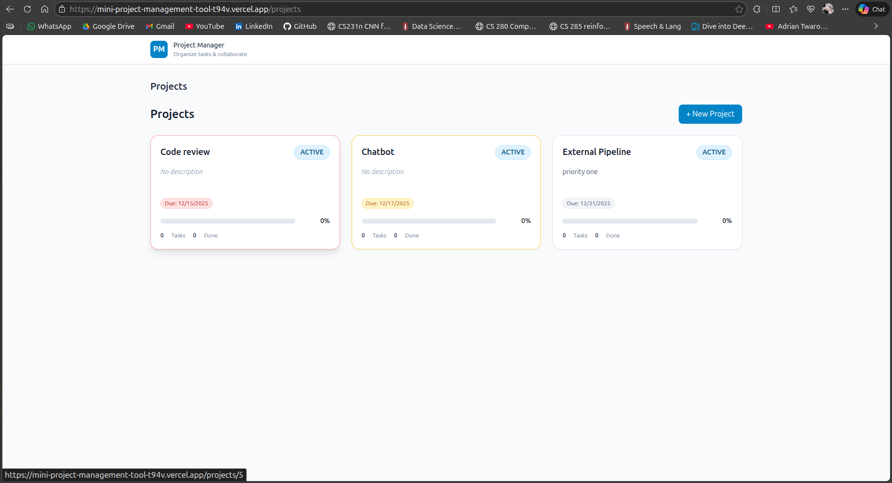
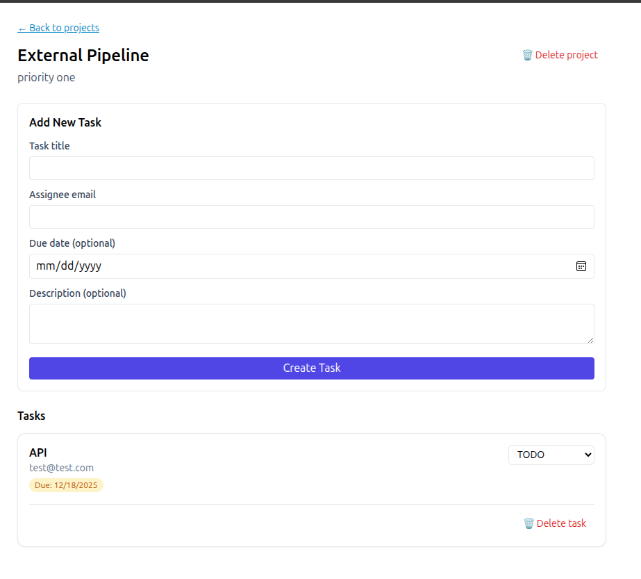

# Project Management System

A full-stack **Project & Task Management System** built with **Django + GraphQL + PostgreSQL** on the backend and **React + TypeScript + Apollo Client** on the frontend.

The application supports **organization-based multi-tenancy**, project tracking, task workflows, and collaborative task comments.

---

## 🌐 Live Deployment

- **Frontend (Vercel):** https://mini-project-management-tool-t94v.vercel.app/projects
- **Backend (Render):** https://mini-project-management-tool.onrender.com/graphql/
- **Repository:** https://github.com/AnmolManiDubey/Mini-Project-Management-Tool

---

## 📸 Sneak-Peek

| Page | Preview |
|-----|--------|
| Projects Dashboard |  |
| Project Window |  |

---

## 🚀 Tech Stack

### Backend
- Python 3
- Django
- Graphene-Django (GraphQL)
- PostgreSQL
- django-cors-headers

### Frontend
- React (Vite)
- TypeScript
- Apollo Client
- React Router

### Deployment
- **Frontend:** Vercel
- **Backend & Database:** Render

---

## ✅ Core Features

### 🔹 Backend
- Organization-based multi-tenancy using `X-ORG-SLUG` header
- GraphQL API with queries & mutations
- Project, Task, Comment data models
- Task status workflow (TODO → IN_PROGRESS → DONE)
- Automatic task completion tracking
- PostgreSQL relational database
- Production-ready Django setup

### 🔹 Frontend
- Projects dashboard
- Create and manage projects
- Project detail view with tasks
- Create tasks inside projects
- Update task status
- Add comments to tasks
- GraphQL-powered real-time UI updates
- SPA routing with refresh-safe URLs
- Clean, responsive UI

---

## 🧠 Architecture

```

React + TypeScript
↓
Apollo Client (GraphQL)
↓
Django + Graphene
↓
Django ORM
↓
PostgreSQL

````

- Single `/graphql/` endpoint
- Header-based tenant isolation
- Clean frontend–backend separation
- Production deployment with cloud hosting

---

## ⚙️ Local Setup

### Backend

```bash
cd backend
python -m venv venv
source venv/bin/activate
pip install -r requirements.txt
python manage.py migrate
python manage.py runserver
````

GraphQL Playground:

```
http://localhost:8000/graphql/
```

---

### Frontend

```bash
cd frontend
npm install
npm run dev
```

App:

```
http://localhost:5173
```

---

## 🔐 Multi-Tenant Header

All API requests require the organization header:

```
X-ORG-SLUG: Kav
```

This ensures strict tenant-level data isolation.

---

## 🧩 Key Learnings

* Implemented **GraphQL APIs** with Django
* Built **organization-based multi-tenant architecture**
* Integrated **Apollo Client** for frontend data handling
* Deployed full-stack application using **Vercel & Render**
* Debugged real-world production issues (DB migrations, CORS, env vars)
* Designed scalable backend architecture

---

## 🔮 Future Improvements

* Authentication & role-based access control
* Organization creation from UI
* Activity logs & audit trails
* Task filtering & search
* Real-time updates with subscriptions
* File attachments for tasks

---

## 👨‍💻 Author

**Anmol Mani Dubey**
Final Year Engineering Student
AI & Data Science | Full-Stack Developer

* GitHub: [https://github.com/AnmolManiDubey](https://github.com/AnmolManiDubey)
* LinkedIn: <YOUR_LINKEDIN>

---